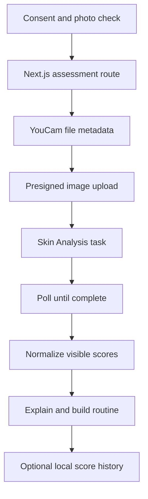

# API-Skin-AI
API Skin AI is a consent-first consumer web app that uses the YouCam Skin Analysis API to turn a clear face photo into understandable visible skin indicators, a conservative skincare action plan, and optional score-only progress check-ins.
It is deliberately more than an API demo: the product validates input quality, explains privacy and provider retention before upload, translates raw analysis into inclusive language, escalates user-reported warning symptoms, recommends safe product categories, and enables local comparison without storing photos in the app.

> **Safety:** API Skin AI provides educational cosmetic guidance. It is not medical advice and does not diagnose, treat, cure, or prevent any condition.

## MVP features

- Explicit, versioned consent before the image selector is enabled
- JPG/PNG, size, resolution, aspect-ratio, and broad lighting checks
- Mobile camera capture and desktop drag-and-drop upload
- Four-stage YouCam v2 integration: initialise file, upload to presigned URL, create task, poll result
- Server-only API key and normalized response boundary
- Loading, success, empty, rate-limit, timeout, unsuitable-photo, and provider-error states
- Plain-language visible indicator scores and labels
- Conservative AM/PM action plan using product categories
- Professional-review guidance when the user reports pain, bleeding, an open area, or rapid change
- Optional score-only history in browser local storage; delete-all control included
- Clear mock-data badge for API-free development and judging fallback
- Responsive UI, keyboard focus styles, reduced-motion support, and semantic status messaging

## Architecture



The browser never receives the YouCam API key or presigned upload URL. The server does not intentionally log image bytes, credentials, or raw provider payloads, and returns a normalized result only.

## Local setup

### Requirements

- Node.js 20.9 or newer
- npm 10 or newer
- A YouCam API key for live mode

### Install and run with labelled demo data

```bash
git clone <your-repository-url>
cd api-skin-ai
npm install
cp .env.example .env.local
npm run dev
```

Open [http://localhost:3000](http://localhost:3000).

The example environment starts in `YOUCAM_MOCK_MODE=true`. The complete product flow works, but the result screen clearly identifies scores as demo data.

### Enable live YouCam Skin Analysis

Create or update `.env.local`:

```dotenv
YOUCAM_MOCK_MODE=false
YOUCAM_API_KEY=your_server_side_api_key
YOUCAM_API_BASE_URL=https://yce-api-01.makeupar.com
YOUCAM_API_VERSION=v2.0
YOUCAM_SKIN_ACTIONS=wrinkle,pore,texture,acne,moisture,oiliness,redness,dark_circle_v2,spot,radiance
YOUCAM_POLL_INTERVAL_MS=1200
YOUCAM_POLL_MAX_ATTEMPTS=25
```

Restart the dev server after changing environment variables. Never prefix the credential with `NEXT_PUBLIC_` and never commit `.env.local`.

## YouCam API implementation

The server adapter in `src/lib/youcam.ts` follows YouCam’s current asynchronous workflow:

1. `POST /s2s/v2.0/file/skin-analysis` with file metadata.
2. Upload the actual image bytes to the returned presigned `requests.url` using the returned method and headers.
3. `POST /s2s/v2.0/task/skin-analysis` with `src_file_id`, `dst_actions`, and JSON output format.
4. `GET /s2s/v2.0/task/skin-analysis/{task_id}` until `task_status` is `success` or `error`.
5. Normalize provider output into the app’s stable `AssessmentResult` contract.

Primary references:

- [YouCam API Quick Start Guide](https://docs.perfectcorp.com/develop/quick_start_guide)
- [AI Skin Analysis reference](https://docs.perfectcorp.com/reference/ai_skin_analysis)
- [API server](https://docs.perfectcorp.com/develop/api_server)
- [Rate limits](https://docs.perfectcorp.com/develop/rate_limit)
- [Error codes](https://docs.perfectcorp.com/develop/error_codes)
- [File retention period](https://docs.perfectcorp.com/develop/file_retention_period)

`YOUCAM_SKIN_ACTIONS` uses standard-definition actions by default. Do not mix SD and `hd_` actions in one task. Confirm the actions enabled for your YouCam plan in the API console before the live demo.

## Privacy model

- The app requires consent before accepting a photo.
- The Next.js server processes the upload in memory and does not include database or object-storage code.
- YouCam states that uploaded files and file identifiers are retained for 30 days and then automatically removed. This is disclosed before consent and on the result screen.
- Saving a check-in is optional and stores only the normalized result in the current browser’s local storage.
- The photo is not included in saved history.
- Users can remove the selected photo before analysis and delete all local history.

Before production, complete a formal privacy/data-processing review, verify regional terms, add operational monitoring, and confirm whether an account-specific early-deletion mechanism is available.

## Commands

```bash
npm run dev       # local development
npm run lint      # ESLint and Next.js rules
npm run test      # Vitest unit tests
npm run build     # production build
npm run start     # run the production build
```

## Repository map

```text
src/
├── app/
│   ├── api/assess/route.ts     # consent/file validation and analysis boundary
│   ├── api/health/route.ts     # non-secret deployment readiness
│   ├── privacy/page.tsx        # plain-language privacy and limitations
│   ├── globals.css             # responsive visual system
│   ├── layout.tsx
│   └── page.tsx
├── components/
│   └── assessment-studio.tsx   # consent → photo → plan → history journey
└── lib/
    ├── indicators.ts           # provider-to-consumer terminology mapping
    ├── mock-assessment.ts      # labelled demo result
    ├── photo-validation.ts     # client/server input checks
    ├── routine.ts              # conservative action-plan rules
    ├── types.ts                # stable application contracts
    └── youcam.ts               # protected four-stage provider adapter
```

Additional hackathon materials are in [`docs/`](docs/): architecture, testing checklist, Devpost draft, and demo script.

## Hackathon alignment

| Judging criterion | Evidence in this project |
|---|---|
| Technological implementation | Complete asynchronous YouCam workflow, secure server boundary, response normalization, error mapping, tests, health endpoint |
| Design | Consent-first mobile journey, quality feedback, clear loading/result/empty/error states, accessible controls |
| Potential impact | Helps skincare shoppers understand visible concerns, choose a measured routine, and see whether something appears to change |
| Quality of idea | Connects assessment to action and longitudinal context while making privacy and uncertainty part of the product |

## Licence

MIT. See [LICENSE](LICENSE).
giItT1WQy@!-/#giItT1WQy@!-/#
